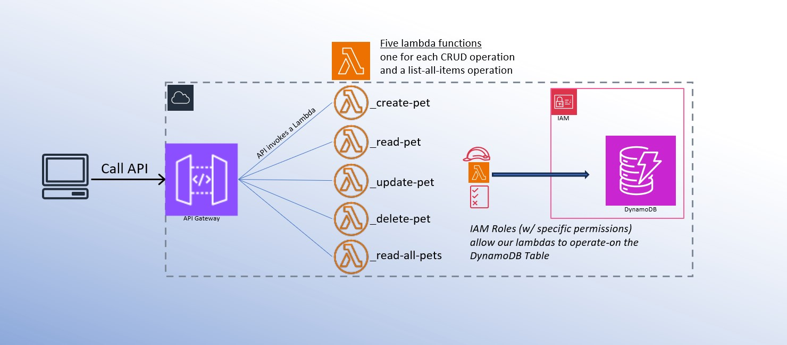
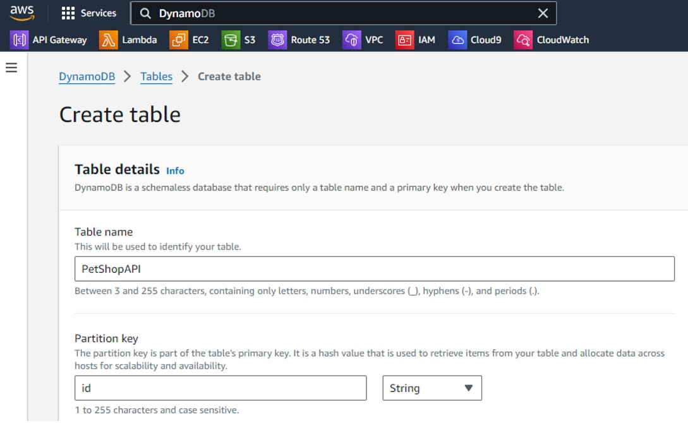
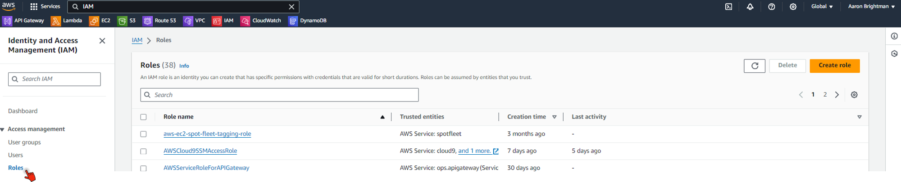

# PetShopAPI (a demonstration of Microservices)
A 100% Serverless Architecture for a CRUD API.\
\
Very quickly, we are going to go through setting up a basic CRUD API using AWS technologies.\
Each of the components of the architecture (inlcuding the compute and database) are serverless, and will not require any of the provisioning of a traditional on-premesis CRUD deployment.
\
\
We also have the benefit of speed, modularity, and the massive scallibility of the AWS Cloud.\
Here we go!

## Overview

The entry point for our client is the API Gateway, which exposes our backend to a public URL and utilizes HTTPs methods to call our functions.  Each of the Gateway's publicly exposed HTTP endpoints (PUT, PATCH, POST, DELETE, and GET) trigger their own Lambda function to perform their designated operations on the database.  Specific IAM permissions are nessiccary for the Lambda functions to operate on the database, this is becuase resources on AWS operate on a 'whitelist' security model.
\
the POST method expects a body payload in JSON like this: 


```json
{
        "id": "007",
        "name": "Julio",
        "owner": "Aaron",
        "breed": "Dachshund",
        "gender": "male",
        "birthday": "08-08-2008"
}
```
## Deployment
We'll start with the database, and move from right to left setting up what is in the diagram. \
From the AWS console, open DynamoDB and create a table ("PetShopAPI") and use the string "id" as the Partition Key, and create the table.


\
moving on, before we set up our Lambda Functions, lets create an IAM role with permission to access the new database.\

the custom permission string would look like this, with your own database ARN used in the Resource attribute.
```json
{
  "Version": "2024-08-18",
  "Statement": [
    {
      "Sid": "DynamoDBTableAccess",
      "Effect": "Allow",
      "Action": [
        "dynamodb:DeleteItem",
        "dynamodb:GetItem",
        "dynamodb:PutItem",
        "dynamodb:Query",
        "dynamodb:Scan",
        "dynamodb:UpdateItem"
      ],
      "Resource": "<YOUR TABLE'S ARN GOES HERE>"
    }
  ]
}
```

Alternatviely, and much easier when using the AWS console, assign the template permission called "AmazonDynamoDBFullAccess"

