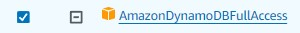
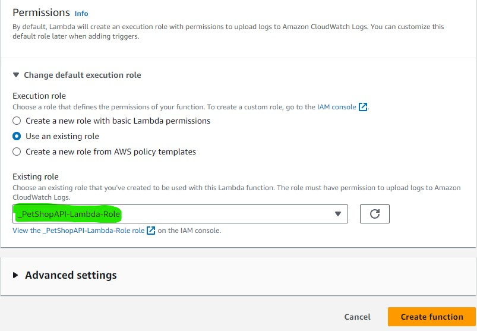
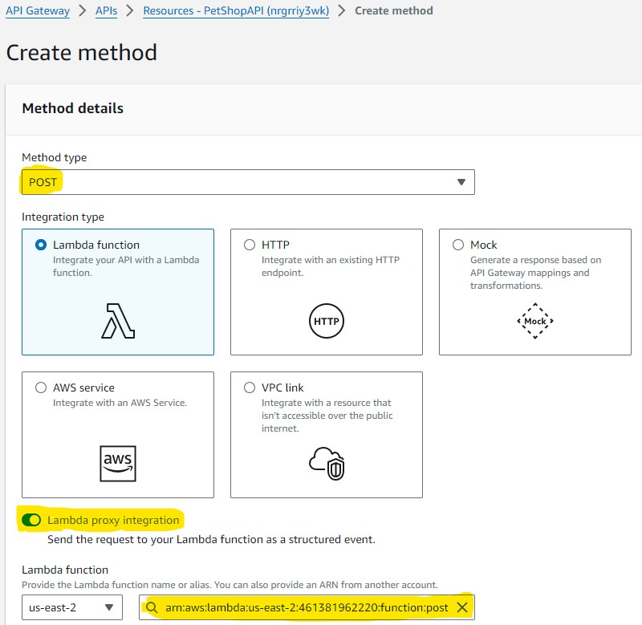

# PetShopAPI (a demonstration of Microservices)
This is a 100% Serverless Architecture for a CRUD API.\
\
Very quickly, we are going to go through setting up a basic CRUD API using AWS technologies.\
Each of the components of the architecture (inlcuding the compute and database) are serverless, and will not require any of the provisioning of a traditional on-premesis CRUD deployment.
\
\
We also have the benefit of speed, modularity, and the massive scallibility of the AWS Cloud.\
Here we go!

## Overview

The entry point for our client is the API Gateway, which exposes our backend to a public URL and utilizes HTTPs methods to call our functions.  Each of the Gateway's publicly exposed HTTP endpoints (PUT, PATCH, POST, DELETE, and GET) trigger their own Lambda function to perform their designated operations on the database.  Specific IAM permissions are nessiccary for the Lambda functions to operate on the database, this is becuase resources on AWS operate on a 'whitelist' security model.
\
the POST method expects a body payload in JSON like this: 


```json
{
        "id": "007",
        "name": "Julio",
        "owner": "Aaron",
        "breed": "Dachshund",
        "gender": "male",
        "birthday": "08-08-2008"
}
```
## Deployment
We'll start with the database, and move from right to left, setting up what is in the overview diagram. \
From the AWS console, open DynamoDB and create a table ("PetShopAPI") and use the string "id" as the Partition Key, and create the table.


\
Moving on, before we set up our Lambda Functions, lets create an IAM role with permission to access the new database.
## IAM Role 
In IAM we create a Role, and then give the Role certain permissions.  Later we will give the Role(with its permission attached) to our lambda functions.


In the AWS Console, find the IAM service and 'Create Role' (I named mine '_PetShopAPI-Lambda-Role')

The custom permission string would look like this, with your own database ARN used in the Resource attribute.  So we are giving this role access to CRUD functions on your single database
```json
{
  "Version": "2024-08-18",
  "Statement": [
    {
      "Sid": "DynamoDBTableAccess",
      "Effect": "Allow",
      "Action": [
        "dynamodb:DeleteItem",
        "dynamodb:GetItem",
        "dynamodb:PutItem",
        "dynamodb:Query",
        "dynamodb:Scan",
        "dynamodb:UpdateItem"
      ],
      "Resource": "<YOUR TABLE'S ARN GOES HERE>"
    }
  ]
}
```

Alternatviely, and much easier when using the AWS console, assign the template permission called "AmazonDynamoDBFullAccess" thus giving this Role access to the entire DynamoDB resource and any other database you have there.
 

  

## Lambda Functions
With our IAM role ready, we can create the five Lambda Functions.
\
In the AWS console, find the Lambda service and click-on Create Function \
Here you will name the function, set the runtime environement (my functions provided are in Python) \

 \
Find and assign it the IAM Role that we made, otherwise it will not be able to access our database
 \
With your function created, you can find it on the list and paste in the logic right in the Code tab.
It's important that the Table varible in the code references the name of your database table ('PetShopAPI')
```python
import boto3
import json

def lambda_handler(event, context):
    client = boto3.resource('dynamodb')
    table = client.Table('PetShopAPI')
    
    body = json.loads(event['body'])
    
    response = table.put_item(
        Item={
            'id': body['id'],
            'name': body['name'],
            'breed': body['breed'],
            'gender': body['gender'],
            'owner': body['owner'],
            'birthday': body['birthday']
        }
    )
    
    return {
        'statusCode': 200,
        'body': json.dumps({'message': f"Record {body['id']} added successfully"})
    }
```
Ofcourse you will need to repeat this process for all five of the lambda functions that are found in the Lambda_Functions folder of this git depository.  To access the database, all of the lambdas should be givin the same IAM role ('_PetShopAPI-Lambda-Role')

## API GATEWAY (and done.)
Our API Gateway will securly expose our five Lambda functions to a public URL voila we have a Serverless CRUD API. \ 
The AWS API Gateway service is a config of 'Resources' and HTTP 'Methods' that will reference our Lambda Functions \

In the AWS Console, Find the API Gateway service and create a 'REST API' and give it a name with a 'Regional Endpoint'
 \
Once created, your looking at a configuration of 'Resources' and 'Methods'
\

\
Create two resources: /pet & /pets


\
This is becuause we will have two GET methods exposed:
\
one to find a single Object on the table (/pet)
\
and the other GET will return all of the objects in the database (/pets)

 it should look like this, and now we can set up our methods
\

\
Well start in the /pet resourse and click 'Create Method'
\
Here we make the POST method, turn on proxy integration, and reference the Lambda Function we made earlier "_petshop-post"
\

\
Create the Methods for all of the Lambdas that were made
\

| API METHOD        | Corisponding Lambda                                                |
| ----------------- | ------------------------------------------------------------------ |
|  /pet POST  |  _petshop-post |
|  /pet PATCH | _petshop-update-pet |
|  /pet DELETE | _petshop-delete-pet  |
|  /pet GET  | _petshop-get-pet |
|  /pets GET | _petshop-get-all-pets |
